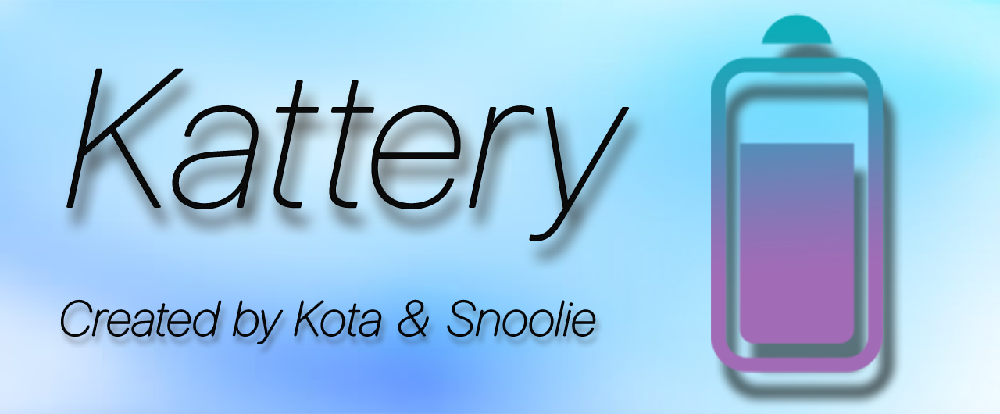

# Kattery
Kattery is an iOS 12-16 tweak that brings a more colorful look to your Icon Labels!!

## Features
**(Uses Alderis Color Picker)**
  - Adjustable Text Colors for the Battery Percent
  - Adjustable Colors for the Battery Details (While charging as well.)
  - Adjustable Wifi & Cellular colors. Including inactive colors.
  - Adjustable Glow Radius
  - Adjustable Glow/shadow(colorable) behind battery, wifi, and cellular ( More coming soon )

## Installation
1. Download the latest `deb` from the [releases](https://github.com/mineek/Glowie/releases) or from Kota's Repo-[Transrights.online](https://transrights.online/) with your preferred package manager.
2. Install Glowie!

## Compatibility
iPhone, iPad and iPod running iOS/iPadOS 12 or later
(rootful & rootless)

## Compiling
  - [Theos](https://theos.dev/) is required to compile the project
  - Depends on [Alderis](https://github.com/hbang/Alderis) & Legacy arm64e Support
  - You may want to edit the root `Makefile` to use your Theos SDK and toolchain
